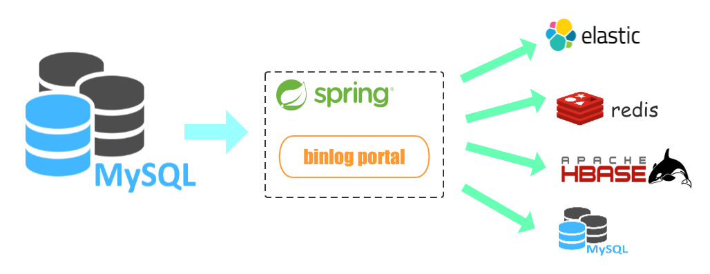

# binlogportal

A simple mysql binlog sync tool

It has following features:

1.Store binlog postion use redis

2.Support springboot starter

3.Easy to use and deploy

- - -
## 项目简介
一个轻量级的mysql binlog同步工具。可以单机部署，同时支持分布式高可用。



项目主要目标是提供可基于spring boot快速部署的同步工具，外部依赖只有redis。

当前版本特性：
- 提供了binlogportal-spring-boot-starter包，可使用spring boot快速部署
- 使用redis保存binlog position信息，重启后可从上次position位置开始
- 当前支持insert和update的结构化
- 提供默认的http事件处理器。可通过实现`IEventHandler`接口，自定义事件处理器
- 使用redis作为分布式协调器，可多机部署实现高可用

## Mysql配置
- Mysql需要开启binlog并设置为row模式
- 同步binlog使用的mysql账号，需要添加REPLICATION权限，示例如下：
```sql
CREATE USER binlogportal IDENTIFIED BY '123456';
GRANT SELECT, REPLICATION SLAVE, REPLICATION CLIENT ON *.* TO 'binlogportal'@'%';
GRANT ALL PRIVILEGES ON *.* TO 'binlogportal'@'%';
FLUSH PRIVILEGES;
```

### 1.快速开始

#### 1.1 通过spring boot构建项目
- 直接依赖binlogportal-spring-boot-starter
```xml
<dependency>
  <groupId>com.insistingon.binlogportal</groupId>
  <artifactId>binlogportal-spring-boot-starter</artifactId>
  <version>1.0.11</version>
</dependency>
```
- 通过spring boot的application.yml配置启动器
```yaml
binlogportal:
  enable: true # 是否启用autoconfig
  distributed-enable: true # 是否启用分布式部署
  distributed-redis: # distributed-enable为true时，要提供一个redis作为分布式协调器
    host: 127.0.0.1
    port: 6379
    auth:
  position-redis: # 保存binlog position的redis，必须配置
    host: 127.0.0.1
    port: 6379
    auth:
  db-config: # 数据库配置，可以有多个，key自定义即可
    d1:
      host: 0.0.0.0
      port: 3306
      user-name: binlogportal
      password: 123456
      handler-list: [logEventHandler] # 该数据库使用的事件处理器，名称为spring的bean name
  http-handler: # 启用自带的http事件处理器，可发送请求
    url-list: [http://127.0.0.1:8988/testit] # 要发送的url列表，http参数为统一的格式
    result-callback: httpCallBack # 配置自定义的结果处理器，需要实现IHttpCallback接口，值为bean name
```
- Starter启动
    - spring boot autoconfig启动成功后，会把BinlogPortalStarter的实例注入到IOC中
    - 项目中通过注入的方式获取binlogPortalStarter使用
    - binlogPortalStarter.start()会为每个mysql库创建一个线程处理binlog
    - 下面是使用CommandLineRunner启动starter的一个例子
```java
@Slf4j
@Component
public class BinlogSync implements CommandLineRunner {
    @Resource
    BinlogPortalStarter binlogPortalStarter;

    public void run(String... args) throws Exception {
        try {
            binlogPortalStarter.start();
        } catch (BinlogPortalException e) {
            log.error(e.getMessage(), e);
        }
    }
}
```

#### 1.2 非spring boot项目
- 非spring boot项目，可以使用基础包
```xml
<dependency>
  <groupId>com.insistingon.binlogportal</groupId>
  <artifactId>binlogportal</artifactId>
  <version>1.0.5</version>
</dependency>
```
- 依赖后实现配置类`BinlogPortalConfig`和`SyncConfig`，传入Starter中运行即可
```java
public class TestClass{
 public static void main(String[] args) {
        SyncConfig syncConfig = new SyncConfig();
        syncConfig.setHost("0.0.0.0");
        syncConfig.setPort(3306);
        syncConfig.setUserName("binlogportal");
        syncConfig.setPassword("123456");

        BinlogPortalConfig binlogPortalConfig = new BinlogPortalConfig();
        binlogPortalConfig.addSyncConfig(syncConfig);

        RedisConfig redisConfig = new RedisConfig("127.0.0.1", 6379);
        RedisPositionHandler redisPositionHandler = new RedisPositionHandler(redisConfig);
        binlogPortalConfig.setPositionHandler(redisPositionHandler);

        binlogPortalConfig.setDistributedHandler(new RedisDistributedHandler(redisConfig));

        BinlogPortalStarter binlogPortalStarter = new BinlogPortalStarter();
        binlogPortalStarter.setBinlogPortalConfig(binlogPortalConfig);
        try {
            binlogPortalStarter.start();
        } catch (BinlogPortalException e) {
            e.printStackTrace();
        }
    }
}
```

### 2.分布式部署实现
项目中高可用实现是基于redis的分布式锁。

每个实例都会加载全部数据库的配置，在创建binlog连接之前，先要获取redis锁，获取锁后会定时刷新锁的过期时间。所有实例会定时重新抢锁。

同一个mysql库的binlog文件和position会保存在redis里，如果一个实例宕机。新抢到锁的实例在初始化时，会使用上个实例已保存的binlog信息继续获取。

